<head>
    <style>
		header p {color:black;}
		footer p {color:white;}
		p.view, p.view+ul li{color:white;}
		img {border: solid 1px #ccc;}
    </style>
</head>

# Tota11y

To help you do a quick check of a web page for the most common accessibility errors, we have a visual tool called Tota11y. It won't catch every problem, but it will catch the [most common problems](https://webaim.org/projects/million/#wcag) that we find on Babylon sites, and highlights them in your browser window, so you can check pages while you're editing content, before they ever go live.

 To install it, plase drag this link to your browser's bookmark bar: <a href=" javascript:(function()%7Bvar tota11y%3Ddocument.createElement(%27SCRIPT%27)%3Btota11y.type%3D%27text/javascript%27%3Btota11y.src%3D%27https://totally.ops.babylontech.co.uk/tota11y.min.js%27%3Bdocument.getElementsByTagName(%27head%27)%5B0%5D.appendChild(tota11y)%3B%7D)()%3B">Tota11y!</a>

You should now see a button in your bookmark bar:

 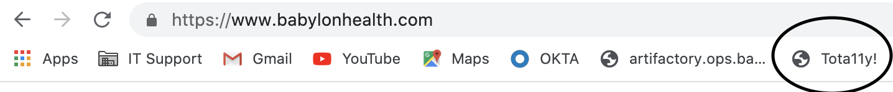

 Clicking this button will summon Tota11y to the bottom left of the webpage you're currently on. You may have to accept cookies or otherwise dismiss any banners that appear on the bottom of the page if they are obscuring the Tota11y icon.

 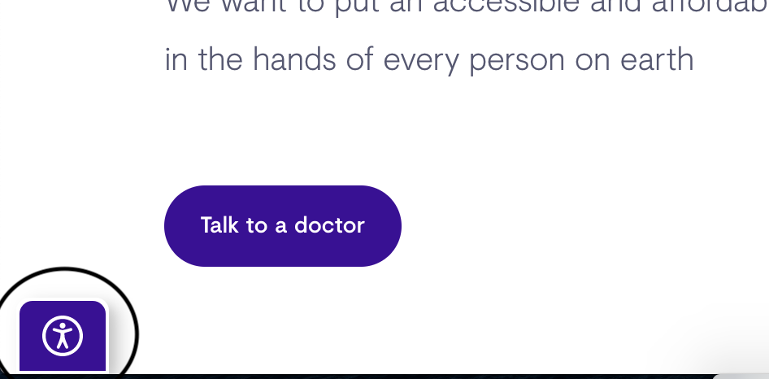

 Clicking this icon will expand the menu:

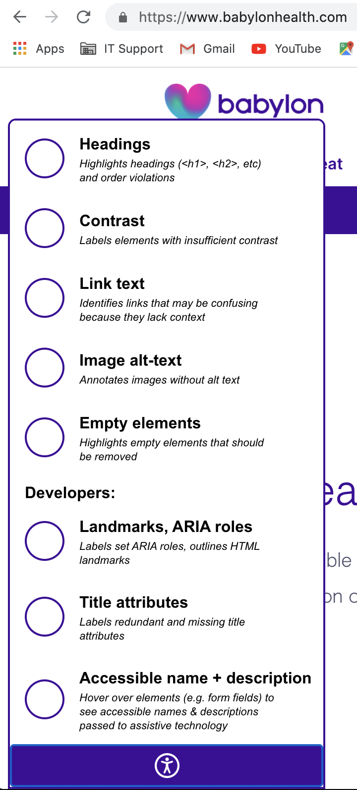

If the expanded menu is obscuring some information, you can shrink it again by clicking the icon.

The bookmark button injects Tota11y into the current page. If you refresh it, or navigate to another page, you'll need to click the bookmark button again. To remove the Tota11y menu, refresh the current page.

## Instructions

 The menu is split into two sections. The upper section is mostly applicable  for content editors, and the lower section for 'developers' (i.e., people with control over HTML blocks and form fields).

### Headings

 A good heading structure is vital for people using assistive technology such as screen readers. The first heading on a page should be an &lt;h1>, and after that there should be a logical hierarchy, with no heading levels skipped.

 Selecting the 'Headings' option from the menu will show you the headings hierarchy of the page in an accompanying info panel (you can drag the info panel by its top title bar if it's obscuring content you need to see):

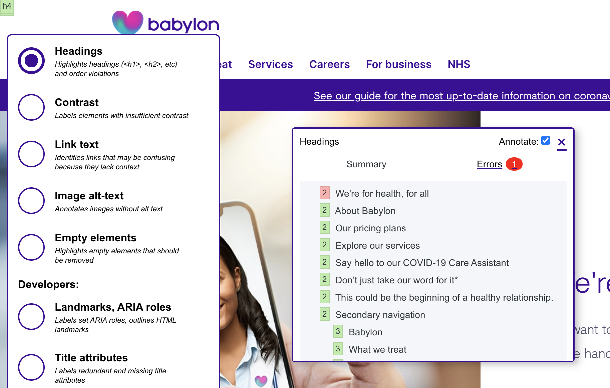

The info panel shows that the headings hierarchy is incorrect; clicking "Errors" will give further information–in this case, that the first heading is not an &lt;h1>. The relevant code is displayed:

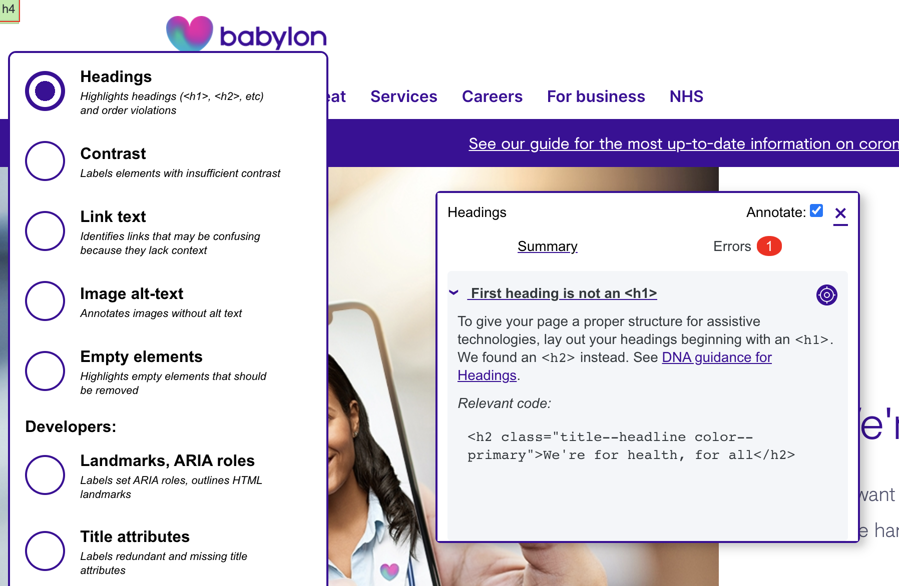

On the top right of the error explanation you'll see an icon called the "sniper rifle sight thing that Jack Roles made"; clicking this will take you to the actual error on the page:

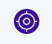

### Contrast

Insufficient contrast [was reported as a problem](https://websitesetup.org/web-accessibility-checklist/#post-16747:~:text=respondents%20with%20disabilities%20were%20asked%20what%20the%20main%20blocks%20to%20them%20completing%20purchases%20were) by 56% of disabled web users in a 2019 survey. The rules for contrast are relatively complex (it depends on the size of the text, its opacity and so on). Tota11y will check text against its background colour, but **it doesn't analyse pixels**, so isn't able to check text that overlays a gradient, pattern or an image (but we shouldn't really do that, anyway).

Choosing the Contrast option will overlay green or red indicators. A green overlay shows adequate contrast (and its computed ratio);

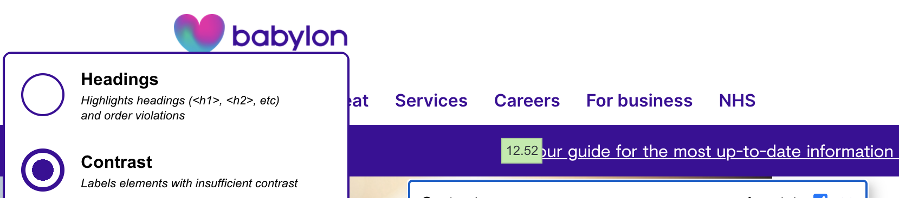

Areas with inadequate contrast are highlighted in red. The Info Panel will suggest combinations near to the current colours which have an adequate contrast ratio:

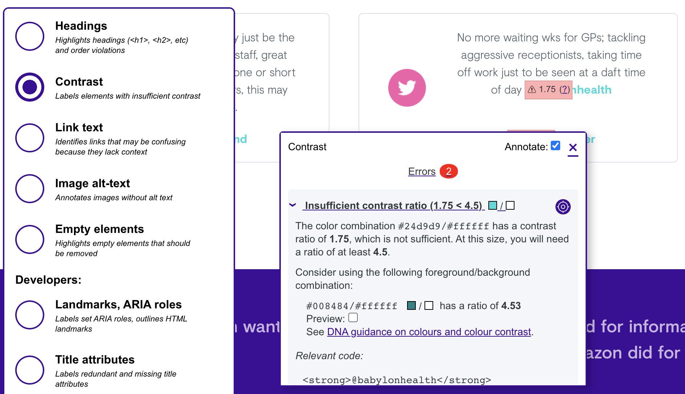

### Link text

[77% of screen reader users](https://websitesetup.org/web-accessibility-checklist/#post-16747:~:text=respondents%20with%20disabilities%20were%20asked%20what%20the%20main%20blocks%20to%20them%20completing%20purchases%20were) reported poor link text as a problem for them. It's important that the same text doesn't link to different places, and that link text gives an idea of where the link will take them, as keyboard users can tab from link to link—if each link reads "click here" or "read more", it's not helpful.

This menu option checks link text against a dictionary of commonly used phrases such as these. In the case of "About", used once on each Babylon page, our judgement is that this is acceptable.

### Image-alt text

"A picture is worth a thousand words" goes the old saying. But for someone with low vision, or on a very slow device, that picture may not be visible, so it needs **alternate text** to describe it.

``````

(Note that we don't prefix it with "image of" or "picture of" because assistive technology will do that automatically.)

Images that are purely decorative or which repeat information already presented in textual format (for example, a pie chart that reinforces the text of an article), the alt text can be blank.

In the case of images which are links, for example, the Babylon logo in the website header which links to the home page, the alt text should describe the destination, not the image:

``````

The image-alt text option of Tota11y will check that each image has alternate text. Images without alt text will be highlighted in red, indicating they must be corrected before the page is made live. (This example is not from Babylon as I couldn't find one, luckily.)

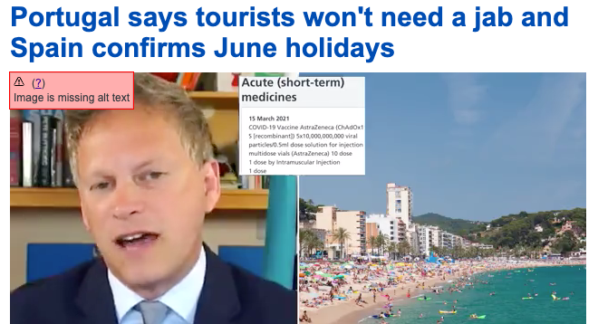

Any image it finds with blank alt text will be marked as "decorative". It's up to you to verify that the image is actually decorative so doesn't need alternate text.

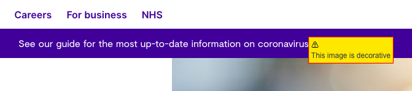

It can't verify that any text it finds is useful, but will ask you to check that by hovering over the overlay. Here's an example of bad alternate text:

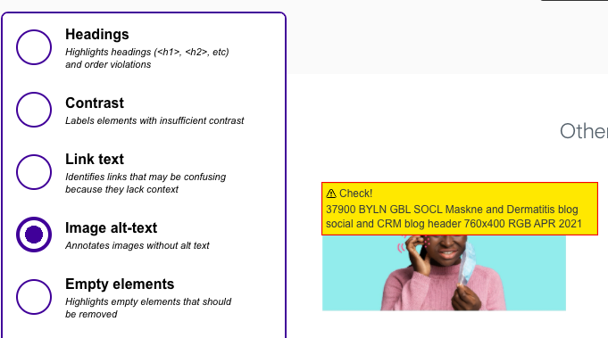

This text doesn't describe the image in a useful way, and should be rewritten before the page is made live.

### Empty Elements

When we remediated the marketing sites in 2020, we noticed lots of empty headings, or multiple ```<br>``` elements, presumably for spacing. These can be announced to assistive technology users, but with no further information (because they're blank), amd so will be confusing and give a worse experience

Multiple ```<br>``` tags are shown in yellow as a warning, as they won't hurt user experience (but which may indicate that the component needs some designer/ developer love):


Here, an empty ```<li>``` tag (not on a Babylon site!) is shown in red as an error, because it will confuse a screen reader user. This should be removed before the page is made live.

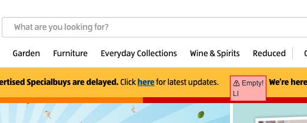


### Developer Modules

These modules are primarily for developers, those who create and amend components. There's nothing to stop you using these modules to investigate a page, but note that you may not be able to make any necessary changes (but please let a developer know so they can do the work!)

#### Landmarks, ARIA Roles

This module outlines and labels HTML5 landmark elements that can help assistive technology users understand and move around a page.

It also exposes authored ARIA roles, so you can check whether a role is overriding the intrinsic role.

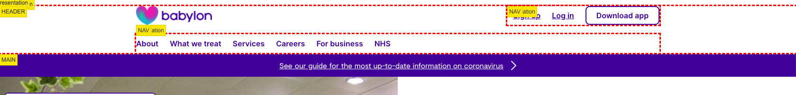

#### Title attributes

Nothing on Babylon sites should have a ```title``` attribute, due to its historical mis-use to placate the false idols of Search Engine Optimists (see [The Trials and Tribulations of the Title Attribute](https://www.24a11y.com/2017/the-trials-and-tribulations-of-the-title-attribute/). The only exception  for ```<iframe>```, where it's required. This module exposes titular naughtiness; red for errors which **must** be corrected, amber for superfluous titles which should be removed when possible.

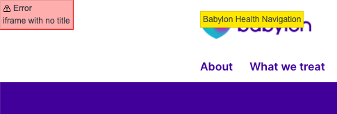

#### Accessible name + description

This module allows developers to hover over form input fields and see authored information that is passed to assistive technology. (Other information, such as whether the field is required, disabled, checked, or selected may also be communicated to the user, depending on the screen reader).

The primary use of this module is to verify that every input field (whether textual, a radio button or a checkbox) gives enough information so someone who can't see the label is able to fill it in. In the example below, the label **and the instructions** are passed to a user who tabs into th form field (by being part of the ```<label>``` element or associated with an ```aria-describedby``` attribute, for example.)

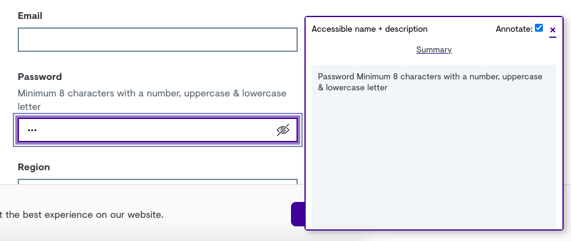
